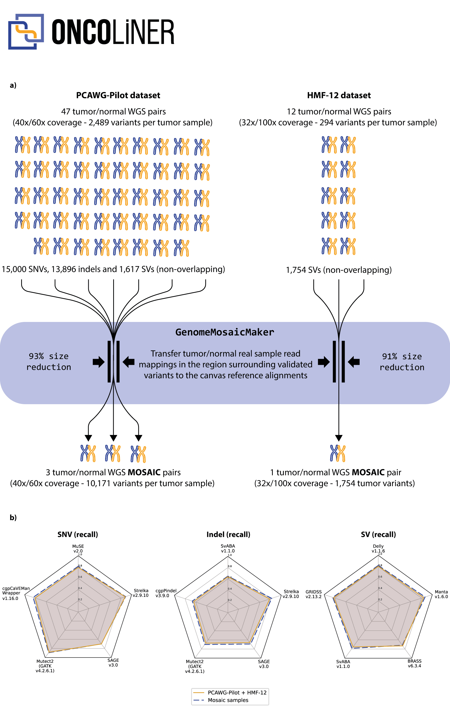

# GenomeMosaicMaker<!-- omit in toc -->

[](https://zenodo.org/doi/10.5281/zenodo.12755101)

GenomeMosaicMaker is a tool for for copying read-alignments regions centered around variants (in VCF/VCF.GZ/BCF format) from existing genomes (in SAM/BAM/CRAM format) to insert them into canvas genomes (in SAM/BAM/CRAM format) to generate mosaic genomes. 

Existing validated datasets tend to be large and require computationally intensive processing due to the inclusion of numerous samples, even when they contain few validated variants. Mosaic genomes significantly reduce benchmarking efforts, while retaining the intrinsic noise and read sequencing representation of the original samples, and therefore also of their assessment properties. The tool is written in Python.

GenomeMosaicMaker is framed under EUCANCan’s (EUropean-CANadian Cancer network) second work package and is used to complement the benchmarking datasets of ONCOLINER. The generation workflow is provided as a standalone Python script with a command-line interface and is optimized for running in a multi-core environment, more precisely in a single node of MareNostrum 4.



## Table of contents<!-- omit in toc -->
- [Installation](#installation)
  - [Singularity](#singularity)
  - [Docker](#docker)
- [Usage](#usage)
  - [Interface](#interface)
- [Authors](#authors)
- [License](#license)


## Installation
### Singularity
We recommend using [`singularity-ce`](https://github.com/sylabs/singularity) with a version higher than 3.9.0. You can download the Singularity container using the following command (does not require root privileges):

```
singularity pull genome-mosaic-maker.sif docker://ghcr.io/computational-genomics-bsc/genomemosaicmaker:latest
```

If you want to build the container yourself, you can use the [`singularity.def`](singularity.def) file (requires root privileges):
```
sudo singularity build --force genome-mosaic-maker.sif singularity.def
```

### Docker
You can download the Docker image using the following command:
```
docker pull ghcr.io/computational-genomics-bsc/genomemosaicmaker:latest
```

You can build the Docker container with the following command (requires root privileges):

```
docker build -t genome-mosaic-maker .
```


## Usage

GenomeMosaicMaker is a command-line tool. Assuming you have a singularity image called `genome-mosaic-maker.sif`, the process for building a mosaic genome (with a normal and tumor sample) is as follows:

```
singularity exec genome-mosaic-maker.sif python3 -O /genome-mosaic-maker/src/combinator/main.py -mp 32 -p 1000 -i input.vcf -if canvas_N.cram canvas_T.cram -o example_out_N.bam example_out_T.bam
```

The input VCF/BCF/VCF.GZ file must have a field named `FILES` in the `INFO` column. This field must contain the paths to the BAM/CRAM/SAM files that will be used to extract the reads. The paths must be separated by a comma (`,`). The number of files must match the number of input canvas files and the order must be the same. The BAM/CRAM/SAM files must be indexed. Check the [example](example/) folder for an example of how to prepare the input VCF.

### Interface

```
usage: main.py [-h] --input INPUT --outputs OUTPUTS [OUTPUTS ...]
               [--canvas-files CANVAS_FILES [CANVAS_FILES ...]]
               [--padding PADDING] [--maximum-processes MAXIMUM_PROCESSES]
               [--fasta-ref FASTA_REF] [--split-read-groups]

optional arguments:
  -h, --help            show this help message and exit
  --input INPUT, -i INPUT
                        Input VCF file
  --outputs OUTPUTS [OUTPUTS ...], -o OUTPUTS [OUTPUTS ...]
                        Output alignment files
  --canvas-files CANVAS_FILES [CANVAS_FILES ...], -if CANVAS_FILES [CANVAS_FILES ...]
                        canvas alignment files
  --padding PADDING, -p PADDING
                        Padding around the variants
  --maximum-processes MAXIMUM_PROCESSES, -mp MAXIMUM_PROCESSES
                        Maximum number of physical processes to use
  --fasta-ref FASTA_REF, -f FASTA_REF
                        Fasta reference file (used for CRAM files)
  --split-read-groups   Keep the read groups separate (they will be
                        anonymized)
```


## Authors

* **Rodrigo Martín** - *Code and Scientific Methodology* - [ORCID](https://orcid.org/0000-0002-2128-1329) [GitHub](https://github.com/Rapsssito)
* **David Torrents** - *Scientific Methodology* - [ORCID](https://orcid.org/0000-0002-6086-9037)

## License

This project is licensed under the BSC Dual License - see the [LICENSE](LICENSE.md) file for details.
